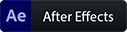
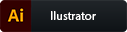

<h2> Olá 👋</h2> 

<h3>Sou Engenheiro de Computação e aqui você encontrará alguns dos meus projetos realizados</h3>
<h4>Possuo graduação em Engenharia da Computação pela Faculdade Independente do Nordeste FAINOR (2021). E Tenho experiência na área de Engenharia da computação, com ênfase em Desenvolvimento de Software.</h4>

 ##  📫 Onde você pode me encontrar:

  
  
  
    
  
  
##  Minhas Estatísticas no GITHUB:

  
  

 
 ##  Experiências:
 
**Meta Soluções** - Desenvolvedor de Sistemas  
*Maio de 2020 até o momento*  
Estágio  
> Atuação no desenvolvimento da plataforma de soluções para e-commerce integrada para otimizar a performance nas vendas além da otimização do tempo dos usuários.  
Atuando também nas integrações com APIs de terceiros, na automatização de processos e otimização das aplicações para manter uma melhor performance, eficiência e garantir alta disponibilidade. 
> Desenvolvimento utilizando a metodologia ágil SCRUM para gerenciamento das atividades.  
Utilizando Exce e ScriptCase.    
Prezando por boas práticas de design e clean code, assim como a realização de code review.  
    
 **Blog do Anderson** - Desenvolvedor Web front-end   
*Agosto de 2020 até o momento*  
Freelancer  

> Cliente: Anderson Oliveira  
Migração do sistema legado Portal Rede para uma nova plataforma, utilizando metodologia ágil.  
Atuando na análise de requisitos e desenvolvimento utilizando Java EE, ColdFusion 11, PL/SQL,
HTML5, CSS3, Bootstrap, JavaScript e JQuery com banco de dados Oracle e Sybase.  
Controle de versão e Integração Contínua com Azure DevOps.

 **Saborreto-GBI** - Desenvolvedor Web front-end   
*Julho de 2019 a Abril de 2020*  
Freelancer  
> Cliente: Pedro Henrique Moreira Alves  
Migração do sistema legado Portal Rede para uma nova plataforma, utilizando metodologia ágil.  
Atuando na análise de requisitos e desenvolvimento utilizando Java EE, ColdFusion 11, PL/SQL,
HTML5, CSS3, Bootstrap, JavaScript e JQuery com banco de dados Oracle e Sybase.  
Controle de versão e Integração Contínua com Azure DevOps.

 **Movimento Pro-Conquistas** - Designer - Desenvolvedor Web    
*Novembro de 2018 a Outubro de 2019*  
Freelancer  

> Cliente: Itamar Figueredo  
Designer e Projetista de posts em redes sociais, editor de videos. Trabalho realizado com o intuito de projetar publicações e info-comerciais em redes sociais com o intuito de aumentar o engajamento. Como editor de videos, os trabalhos realizados foram com o intuito de divulgação de campanhas em redes sociais e televisão.

##  Habilidades e Estudos:
<h3> Essas são algumas Linguagens que já trabalhei e atualmente estudo e você pode acompanhar alguns dos meu projetos acessando as subpastas. </h3> 

                  

<h3> Já desenvolvi e desenvolvo nas seguintes Frameworks. </h3>

  
  
    
  
  
  
  
  
  
    

<h3> E trabalho com algumas ferramentas como:</h3>

  
  
    
  
  
  
  <a href="#" rel="nofollow">
    

##  Curriculo e Formações:
<h4>Durante a Graduação, participei de programas de Projeto de Extensão e Pesquisa, desenvolvendo e participando de atividades extracurriculares efetivamente. Fui responsável pela criação de alguns sites e da realizaçao de eventos. E você pode acompanhar todos acessando o meu curriculo.
esses projetos visualizando o meu curriculo.</h4>

  

##  Outras Habilidades:

<h4>Tive contando com a área de design, e tenho um certo conhecimento em alguns editores de foto, video e audio.</h4>

  
    
      
        
      
      

<h4>E como hobby, estudo modelagem 3d utilizando o blender como programa principal, caso queira acompanhar meu trabalho acesse o Sketchfab.</h4>

  
    

 ##  📫 Onde você pode me encontrar:

  
  
  
    
  

